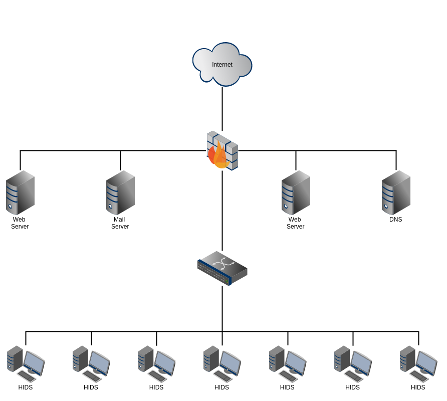
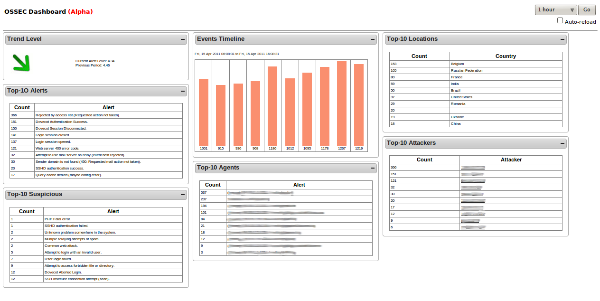
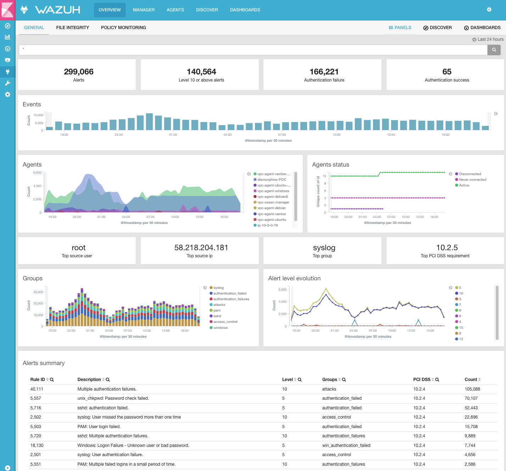
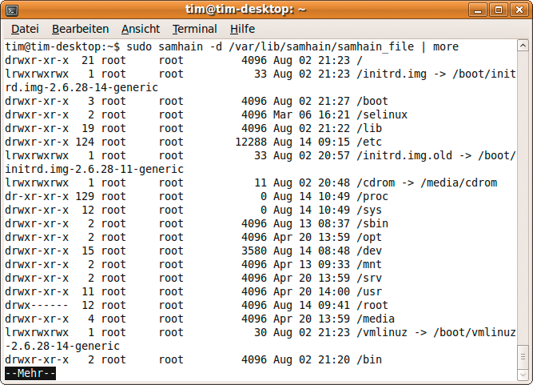
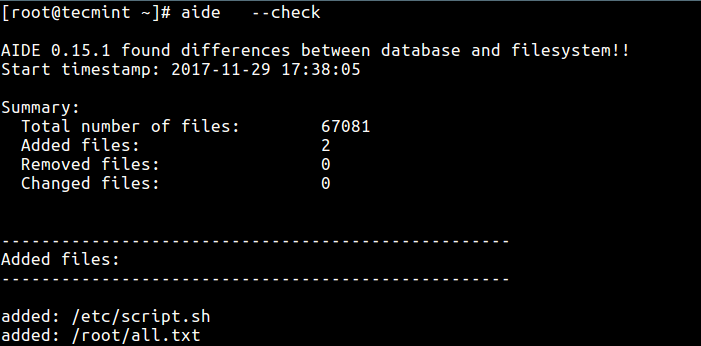

Top Open-source HIDS Evaluation
---

The threat landscape has become increasingly diverse and the systems used to attack are more sophisticated than ever before. 
In 2018, enterprises and organizations of all sizes and across all industries faced serious data breaches 
(information leaks were experienced by Aadhar —1.1B users;  myFitnessPal —150M; Quora—100M; Facebook—29M and many more). 
One of the biggest victims was Marriot. 
A single unauthorized access led to the theft of 500M personal identifiable pieces of information. 
According to the  “2018 Data Breach Investigation Report” more than 73% of breaches were committed by outsiders. 

There’s no question about it, intrusion detection systems are important to ensure the security of modern organizations’ assets and all network traffic. 
These safeguards are used to defend restricted access to an organization’s network. 
When it comes to intrusion detection systems, there are two different types; host-based (HIDS) and network-based systems (NIDS). Network-based IDS analyze network traffic for any intrusion and produce alerts while HIDS trace the hosts’ behaviors for any suspicious activity by examining events on your network.

This article will cover five open-source host-based intrusion detection systems to help you protect your organization.

# About HIDS
Before diving deeper into the HIDS tools, let’s explore what host-based intrusion detection systems are. 
As discussed previously, an intrusion detection system is a hardware or software application that detects and 
alerts administrators when a malicious activity has been detected. 
HIDS mainly focus on monitoring and analyzing log files in order to detect anomalies and unauthorized alterations 
based on predefined policies and a set of rules. 
In other words, the HIDS is as effective as the pre-established rules you’ve added. 
With a large number of stored logs, extracting meaningful information is critical to detect anomalies. 
The extracted information should be accurate. 
Therefore, ensuring the security of those logs is essential to defend against log manipulation.  

Functionalities of a HIDS include:
- Anomaly-based detection
- Signature attack detection
- Zero-day attacks
- Traffic monitoring at host
- File integrity monitoring
- Log analysis
- Compliance and auditing
- Notification and alerting system

# How does a HIDS work?
The dedicated intrusion detection system monitors traffic for malicious activity or policy violations.

It detects known attacks by the specific actions they perform (signatures).

The HIDS analyzes traffic (much like a network traffic analyzer) and behavior that matches these signatures in real-time, in the host.

It can also detect unusual usage patterns with anomaly detection methods.

When the HIDS finds a match, it raises an alarm and notifies the administrator.

The HIDS is installed on the host, while the NIDS is placed inline.

The HIDS protects the system at the source so that it can be deeper and more intense in its security. The HIDS can also monitor system files, executables, and log files in the host computer and look for attack signatures.

# No 1: OSSEC
OSSEC is short for Open Source Security Event Correlator. 
This established and reputable solution is a free and open-source host-based intrusion detection system developed and 
maintained by the OSSEC foundation thanks to a huge list of contributors. 
It was later owned by Trend Micro. 
This is a growing project with around 5000 monthly downloads and is characterized by its scalability 
and multi-platform aspect because it runs on Windows, different Linux distributions, and MacOS.

As a HIDS, this tool gives you the ability to perform log analysis, file integrity checking, policy monitoring, 
rootkit detection, and active response using both signature and anomaly detection methods. 
It provides valuable insight into systems operations in order to detect anomalies. 
OSSEC employs a server-agent model – meaning a dedicated server provides aggregation and analysis for every host. 
To install and configure OSSEC, the steps are pretty easy, but OSSEC does have some disadvantages. 
For example, if you want to upgrade to a newer version, you will lose the rules you defined due to an overwriting operation 
unless you export the rules and import them after the migration. 
However, if you aggregate multiple devices and different services (web servers, databases, firewalls, etc.) 
OSSEC is a good choice as a powerful log analysis engine.

OSSEC provides the following functionalities:
- Log-based intrusion detection.
- File integrity monitoring.
- Compliance auditing.
- System inventorying.
- Windows registry monitoring.
- Rootkit and Malware detection.
- Centralized policy enforcement.
- Real-time alerting and active response.

# No 2: Tripwire
https://github.com/Tripwire/tripwire-open-source

As the name indicates this is a free and open-source host-based detection system developed by Tripwire. 
The company offers a commercial solution too, but we will focus on the open-source HIDS. 
The open-source Tripwire package runs exclusively on almost all Linux distributions. 
Known for its great capabilities to ensure data integrity, it helps system administrators to detect alterations 
to system files and notifies them if there are corrupted or tampered files.

To install it on your Linux host, you can simply use the apt-get or yum utilities. 
During the installation, you will be asked to add a required passphrase. 
It’s best to select a complex one. 
Once it’s installed, you’ll need to initiate the database and you can easily start your checks. 
If you need a well-integrated Linux intrusion detection system, open-source Tripwire may be your best choice, 
but it comes with a few limitations. 
For example, it does not notify you in real time, so you’ll need to go through the logs by yourself. 
You’ll also need to install it after installing your OS so that it does not detect malicious activities 
prior to its installation.

The following screenshot illustrates the rules and the security level of each one in addition to other indications.

Tripwire HIDS features:
- File integrity monitoring.
- Create system reports.
- Alerting through Email.

# No 3: Wazuh
Wazuh is another open-source monitoring solution for integrity monitoring, incident response, and compliance. 
The latest version, as of the writing of this article, is 3.8.2. 
It was a fork of OSSEC and as the official documentation indicates, it was built with more reliability and scalability. 
Wazuh uses anomaly and signature detection methods to detect rootkits in addition to performing log analysis, 
integrity checking, Windows registry monitoring, and active response. 
It differs from OSSEC in its ability to be integrated with ELK, its improved ruleset, and the ability to use restful API. 
Wazah can also be leveraged to monitor files within Docker containers by focusing on the persistent volumes and bind mounts.

This HIDS is composed of 3 major components: agents, a server, and an elastic stack. 
Its agents run on Windows, Linux, Solaris, BSD, and Mac operating systems. 
To learn how to install the project, it is highly recommended that you follow the official installation guide. 
The steps are easy to follow and well explained. Wazuh comes with a few drawbacks. 
Server installation and API can be painful to get right.

The following screenshot represents the overview dashboard of Wazuh:

Key Features:
- Log data analysis.
- File integrity monitoring.
- CVE databases to detect vulnerabilities.
- Windows registry monitoring.
- Malware and rootkit detection.
- Configuration assessment.
- Alerting and active response.
- PCI DSS compliance.
- Cloud and container security.

# No 4: Samhain
https://la-samhna.de/samhain/s_download.html

Samhain is an open-source HIDS with central management that helps you check file integrity, monitor log files, and 
detect hidden processes. 
This multi-platform solution runs on POSIX systems (Unix, Linux, Cygwin/Windows).

Samhain is really simple to install, you just need to download the tar.gz file from the official web page 
and install it on your system. 
Before that, you need to ensure that MySQL and Apache are running on your server. 
Samhain projects come with extensive and detailed documentation. 
This HIDS also provides centralized and encrypted monitoring capabilities over TCP/IP communications. 
It differs from the other previously discussed open-source HIDS by its stealth capabilities—masking itself 
from intruders—thanks to the paranoid code put together by its developers. 
While the Samhain community is good, it is more difficult to install than the other HIDS. 
Windows’ clients require Cygwin to be installed plus its reports are difficult to understand at first.

Samhain provides:
- File integrity checking.
- Logfile monitoring and analysis.
- Port monitoring.
- Rootkit detection.
- Rogue SUID executables detection
- Hidden processes detection.
- Compliance with PCI DSS

# No 5: Security Onion
Security Onion is a free and open-source intrusion detection system built on Linux designed and maintained by Doug Burks. 
This project is composed of three components: full packet capture function, intrusion detection systems 
that correlate host-based events with network-based events in addition to many other toolsets 
including Snort, Bro, Sguil, Suricata, and many other utilities.

Security Onion is more than an intrusion detection system. 
At the end of the day, if you want to set up a Network Security Monitoring (NSM) platform easily and within minutes, 
this tool is the answer thanks to its friendly wizard.

Before installing it, you need to know that Security Onion only supports 64-bit hardware. 
You can find in-depth technical requirements in the official documentation as well. 
The installation steps of Security Onion are quite easy. 
After reading the documentation, including the requirements and the release notes, you need to download an ISO image.

Security Onion is the best choice if you are pressed for time, but it has some drawbacks. 
First, It doesn’t support Wi-Fi for managing the network. 
Plus, you’ll have to learn how to handle the different tools to learn make distribution efficient. 
In addition to that, it doesn’t automatically backup configurations other than rules. 
To do that you’ll need to use third-party utilities.

This screenshot illustrates real-time events detection using Security Onion (Sguil):

# No 6: Sagan
Sagan is a free HIDS that installs on Unix, Linux, and Mac OS. It is capable of collecting Windows event log messages, even though it doesn’t run on Windows. You can distribute the processing of Sagan to keep the overhead on your log server’s CPU light. The system uses both anomaly and signature-based detection methods.

You can set actions to occur automatically when an intrusion is detected. The tool has a few unique features that some of the more prominent HIDS lack. These include an IP geolocation facility that will enable you to raise alerts when activities of different IP addresses are traced to the same geographical source. The tool also allows you to set time-related rules to trigger alerts. The system was written to be compatible with Snort, which is a network detection system, giving Saga NIDS capabilities when combined with a network data collector. Sagan includes a script execution facility that makes this an IPS.

AIDE offers full flexibility when checking the integrity of files.

It allows you to write customized expressions to include or exclude files and directories from the monitoring process.

The software only has robust file integrity checking; it does not perform other HIDS functionalities like log-analysis or rootkit/malware detection.

# No 7: Advanced Intrusion Detection Environment (AIDE)
Advanced Intrusion Detection Environment (AIDE) is a free and open-source HIDS.

AIDE is designed only for checking the integrity of files.

With this tool, you can craft rules that create a database of files that are protected from intrusion.

When you first run AIDE, you generate this baseline database, which is checked frequently against the system.

The software will correlate and find differences between the database baseline and the filesystem.

You can check the following file properties:
- File type
- Permissions
- Inode
- Modification time
- File contents
- Number of links

# Summary
Deploying a host-based intrusion detection system is vital for modern organizations. 
There are many HIDS on the market with different capabilities. 
To help you narrow it down, we selected five open-source tools to give you deep visibility of what’s happening on your hosts. 
The selection was based on a number of criteria including the popularity of the tools, their features, and the hosted operating systems.

# Refs
1. https://logz.io/blog/open-source-hids/
2. https://www.comparitech.com/net-admin/hids-tools-software/
3. https://www.dnsstuff.com/host-based-intrusion-detection-systems
4. https://www.pcwdld.com/host-based-intrusion-detection-systems-hids-tools-and-software

